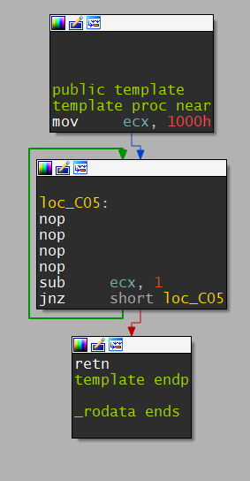
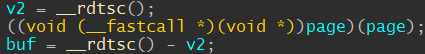

# GoogleCtf: Inst Prof

--------------
# Write-Up

NOTE: All assembly blocks in this example are compiled with fasm.

We are given a linux x64 binary, that reads 4 bytes in a loop, each time allocating a page,
putting there a template function, and filling our 4 bytes in the middle of it.
The template function looks like this:



And the nops are replaced with our 4 bytes.
So it actually runs our 4 bytes in a loop, 0x1000 times. next we can see that our shellcode is timed,
and the result is sent back to us:



This challange was difficut because of the size limit, and the loop.
Most of our attempts were to minimize size of shellcodes, and interrupting the loop somehow.

Now i'll explain the primitives we could achieve, and how we used them to execute code.
Some of the primitives explained are special cases of others, but worth mentioning.

## Leaking a register, or something a register points to
The time (v2 in the image above) is saved in r12. If the shellcode modifies r12, we can leak data.
We whould like to leak a register. Lets say we want to leak rax. If we leak it like that:
```assembly
use64
mov r12, rax
```
We won't be able to restore rax from the returned result (because `rdtsc() - rax` will be returned).
But if we perform the following operation in our shellcode:
```assembly
use64
add r12, rax
```
the value returned home whould be `rdtsc() - old_rdtsc - 4096*rax` (because the instruction is executed 0x1000 times).
We can assume `rdtsc - old_rdtsc` is relatively small, and dividing the entire result by `-4096` will make it even smaller,
giving us rax with decent precision.

### Leaking an address in the main module
This is a private case of "Leaking a register, or something a register points to".
We execute:
```assembly
use64
add r12, [rsp]
```
To leak our return address.
Using that information leak we can break aslr, and know exacly where our module is loaded.

### Leaking the shellcode's address
Every time the program allocates a page with mmap, it is allocated in the same place (if the previous allocation
was released with munmap). If we leak the shellcode's address in a single run, we'll know it is still there when
we execute another shellcode. We use the same register leak, and now leak rdi, or rbx, that contain the address of the shellcode.

## Leaking the entire shellcode
After the shellcode finishes executed, it is released with munmap. The address passed to munmap is stored in the rbx register.
if our shellcode changes rbx, we can cause the deallocation to fail, or deallocate some other page. We found out that we can
corrupt rbx with a single byte (!), leaving us 3 bytes to our choice.
```assembly
use64
xchg eax, ebx
```
(rax contains 0 when our shellcode executes) will zero the lower dword of rbx, causing the munmap to free some other page
(and probably fail). So this primitive allows us to leak 3 executable bytes to our choice, and combined with the previous
primitive we can know their absolute address. neat!

With the little shellcode size, we wanted to call the read syscall onto rsp, so we can control the stack and rop our way to
victory. This however, turned out to be very challanging. We could only reduce the shellcode to 6 bytes. We came up with the
idea to use the binary's `read_n` function. `read_n` gets the address to read into in `rdi`, and the count in `rsi`.
When our shellcode executes, it already have 0x1000 in rsi, so we have 4 bytes to put rsp in rdi, and call `read_n`.
It turned out, some registers (r14 + r15) are unused, and can be assumed to be in our control between shellcodes runs.
With this information, we came up with this shellcode:
```assembly
use64
push rsp
pop rdi
push r15
```
Compiling to 4 bytes exactly, when the template returns, r15 will be executed, with the proper arguments.
Now our only problem is putting `read_n` in r15.

First, we placed the return address in r14 - `mov r14, [rsp]`. then, we found out that there is an instruction
that jumps to `read_n` and is closer to the return address (now in rsp), only 92 bytes away. We wanted to do something
like that - `sub r14, 92`, but the fact that our shellcodes get executed 4096 times prevented it.
We ended up using the lea instruction:
```assembly
use64
lea r15, [r14 - 92]
```

Now we had the ability to control the stack!
This, however, wasn't enough. We lacked two gadgets (`pop rsi; ret` & `pop rdx; ret`).
Using our leak primitive, we leaked two shellcodes looking like that:
```assembly
use64
; Here there is the leak instruction that we didn't write
push rsi
pop rsi
ret
```
Allowing us to create the gadgets, knowing their addresses using the address leak primitive.
Now we had all of the tools to create a rop that can execute `/bin/sh`.

[Full attack script here](./solve.py)
